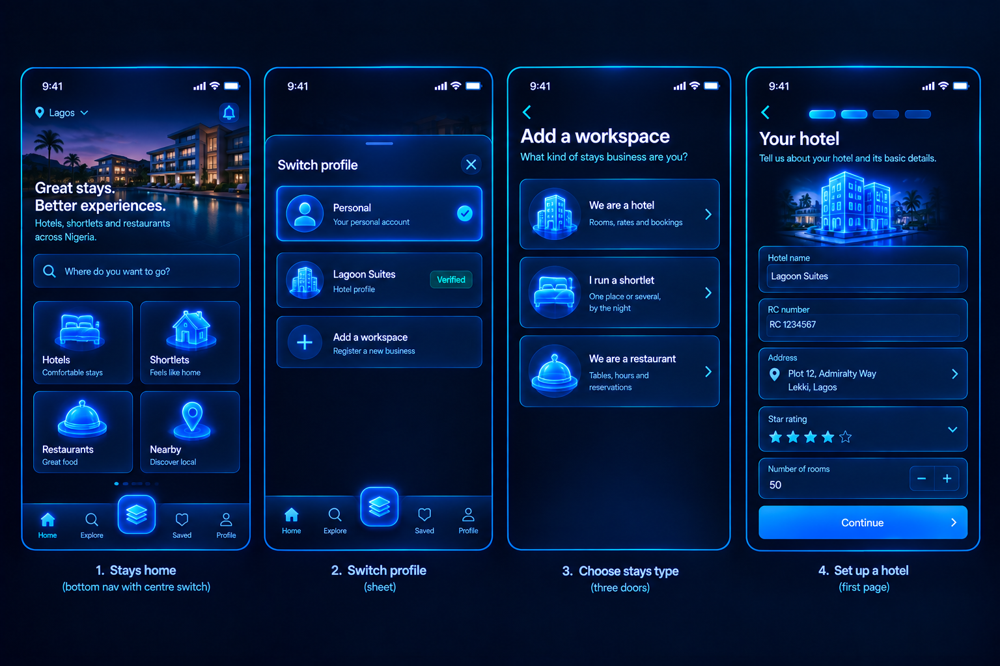

# Vallo

Vallo is a Nigerian marketplace for property and stays. People rent, buy and sell homes, and book hotels, shortlets and restaurants, all through one account with one wallet and one inbox, and every listing is put up by a verified person on the platform, not imported from a feed.

It is built and operated by VALLO SPACES LTD (RC 9870413). Production runs at <https://www.vallospaces.com>. The iOS and Android apps are Capacitor shells that load that origin.

<p align="center">
  
  <br>
  
</p>

These images are the founder's design references from [`docs/design/references/`](docs/design/references/). They are the target the frontend is built to, not screenshots of production. The figures in them, such as listing counts and prices, are illustrative. [`docs/DESIGN_DIRECTION.md`](docs/DESIGN_DIRECTION.md) explains how they govern the UI.

---

## Contents

- [Stack](#stack)
- [Architecture](#architecture)
- [Running it locally](#running-it-locally)
- [Environment variables](#environment-variables)
- [Repository layout](#repository-layout)
- [Database and migrations](#database-and-migrations)
- [Tests and quality gates](#tests-and-quality-gates)
- [Deployment](#deployment)
- [The AI assistant](#the-ai-assistant)
- [Documentation](#documentation)

---

## Stack

| Layer | Choice |
|---|---|
| Web app | Next.js 16 (App Router), React 19, TypeScript 5 (`strict` and `noUncheckedIndexedAccess`) |
| Styling | Tailwind CSS v4, plus design tokens in one stylesheet (`packages/design-tokens/src/tokens.css`) |
| Data, auth, storage | Supabase: Postgres 17 with row level security on every table, Supabase Auth (email and password), Supabase Storage |
| Scheduled work | `pg_cron` inside the database, plus Vercel Cron for the HTTP jobs in `apps/web/vercel.json` |
| Payments | Paystack: the server initialises each transaction and the payer finishes it in Paystack's inline iframe on our own page. Transfers and a signed webhook also go through Paystack. Crypto top-ups go through Yellow Card and stay hidden until it is configured |
| Email | Resend, with a Supabase Send Email hook so auth mail uses the same sender |
| Push | Web Push (VAPID), Firebase Cloud Messaging and APNs, through one drain in `lib/push/` |
| Maps | Leaflet. CARTO tiles by default, MapTiler when a key is set |
| Native | Capacitor 8. The shell loads the live origin, with an offline fallback page |
| Hosting | Vercel |
| Languages | English, Yoruba, Hausa and Igbo (`packages/i18n`) |

Some choices that shape the code:

- **Server-first.** Most mutations are server actions. The root layout reads cookies, so every route renders dynamically. This is also why the native apps load the live site: the app cannot be exported as static files.
- **The database enforces the rules.** Money functions, booking state machines, availability and grants live in Postgres as RLS policies, `security definer` functions in a `private` schema, constraints and triggers. The application calls them. It does not re-implement them.
- **Missing credentials degrade.** No integration throws at startup. Remove a key and its feature shows a designed empty or unconfigured state, so the app boots and can be clicked through with an empty environment.
- **One content security policy with a fresh nonce per request.** `apps/web/src/proxy.ts` sets it through `lib/security/csp.ts` and also refreshes the Supabase session. (Next.js 16 renamed `middleware.ts` to `proxy.ts`. Some older docs still use the old name.)
- **No third-party analytics or crash SDK in the browser.** Browser errors post to `/api/client-error` on our own origin. The server scrubs them and forwards them to Sentry when `SENTRY_DSN` is set.

---

## Architecture

### One product, two sides

The app has two faces over one backend. `apps/web/src/lib/side.constants.ts` defines them:

- **Property:** rentals, sales, agents and inspections. Rooted at `/home` and `/search`.
- **Stays:** hotels, serviced apartments, guest houses, resorts, shortlets and restaurants. Rooted at `/stays`.

Both sides share the account, wallet, messages, notifications, profile and social feed. One control flips between them, and the choice is stored in the `nf_side` cookie. A side-owned URL always wins over the cookie. For example, a hotel link shared in a chat always opens in the Stays shell. **The side only controls what is shown. It is never used for authorisation.** RLS and role reads decide what a person may do.

### Personal and working mode, workspaces and supply roles

`lib/mode.constants.ts` and `lib/supply/roles.ts` define three separate axes:

| Axis | Values | Stored in |
|---|---|---|
| Side | `property`, `stays` | `nf_side` cookie |
| Mode | `personal` (using the platform), `working` (running a business on it) | `nf_mode` cookie |
| Workspace | `owner`, `agent`, `firm` (property); `host` (stays); `console` (staff) | `nf_workspace` cookie, re-resolved against the caller's own RLS-bound reads on every request |

On the property side, supply comes through three doors:

- An **owner** is a person listing their own property.
- An **agent** is a person listing under a mandate.
- A **firm** is an organisation: a `businesses` row with its own registration ladder. Its proof set is an agent's plus incorporation and association.

A listing records which of the three is offering it, because "listed by the owner" and "listed by an agent" are different offers to the person searching. Stays supply is a `host` workspace, set up through the hotel, shortlet or restaurant door (`/host`). Staff work in the admin console at `/admin` (see [`docs/ADMIN_CONSOLE.md`](docs/ADMIN_CONSOLE.md)).

Verification follows a ladder, defined as data in `lib/trust/verification.ts`. The verified badge appears only on first-party entities that passed it.

### Money

All amounts are **integer kobo** in `bigint` columns whose names end in `_minor` (`amount_minor`, `total_minor`, `rent_amount_minor` and so on). No float ever touches money. `lib/payments/money.ts` formats naira from kobo using integer arithmetic.

The wallet (`supabase/migrations/20260728202225_wallet.sql`, `lib/wallet/`):

- **Ledger rows are only ever added.** `public.wallet_entries` gets a row for every movement. Rows are never deleted and their amount is never changed. Each row has a `kind` (deposit, withdrawal, payment, refund, transfer in, transfer out) and a `direction`, and a check constraint ties every kind to its one legal direction. Amounts are always positive.
- **Status moves forward only.** An entry is written as `PENDING`, `COMPLETED`, `FAILED` or `REVERSED`. A pending entry can later be settled to one of the other three by its reference, for example when a Paystack transfer succeeds or fails. That status change is the only update the ledger code makes.
- **Balances are computed, never stored.** `wallets` has no balance column. `private.wallet_balance` returns completed credits minus completed debits. `private.wallet_spendable_locked` also subtracts pending debits, so money held for an in-flight withdrawal cannot be spent twice. Callers first lock the wallet row (`private.wallet_for_update`, `FOR UPDATE`), and every money door (bookings, withdrawals, escrow, send money) uses this one definition.
- **Every write is idempotent.** `reference` is unique, so a replayed webhook or the redirect-verify fallback cannot post twice. Payment references have fixed prefixes defined in `lib/payments/references.ts` (among them `rm-fund-`, `rm-wd-`, and `rm-p2p-...-out` and `-in`), and the webhook decides how to settle each payment from its prefix.
- **Only the service role writes money.** Clients have no write policies on either wallet table. Owners read their own rows and admins read all of them.
- **A reconciliation job checks the ledger.** `/api/paystack/reconcile` runs hourly. It asks Paystack what was actually charged and posts anything the webhook missed.

There is escrow machinery for held payments (`lib/escrow/`, `docs/adr/0001-...`). Who holds that money has not been decided. The product describes the effect of a hold, not its custodian, and the purpose gate refuses every purpose except the agency fee. [`docs/wallet/WITHDRAWAL_PATH.md`](docs/wallet/WITHDRAWAL_PATH.md) traces a withdrawal from end to end.

### Where things live

| Concern | Location |
|---|---|
| Signed-in product routes | `apps/web/src/app/(app)/` (home, search, listing, stays, restaurants, wallet, messages, bookings, escrow, profile and more) |
| Sign-in, sign-up, password reset | `apps/web/src/app/(auth)/` |
| Public site pages (about, terms, privacy, help, careers) | `apps/web/src/app/(site)/` |
| Agent workspace | `apps/web/src/app/agent/` |
| Stays host workspace | `apps/web/src/app/host/` |
| Admin console | `apps/web/src/app/admin/` |
| HTTP endpoints (webhooks, cron, assistant, push) | `apps/web/src/app/api/` |
| Component and harness previews (return 404 unless the preview harness is open) | `apps/web/src/app/(dev)/` |
| Domain logic, server actions, queries | `apps/web/src/lib/<domain>/` |
| UI components | `apps/web/src/components/`, `apps/web/src/design-system/` |
| Database schema | `supabase/migrations/` |

---

## Running it locally

### Prerequisites

- Node.js 20.9 or newer (the root `package.json` `engines` field). CI uses Node 22.
- npm, which comes with Node. This is an npm workspaces monorepo, so do not use yarn or pnpm.
- Access to a Supabase project if you want real data. Without one the app still runs, but every data surface shows its empty state.
- For the native apps: Xcode and/or Android Studio. See [`docs/MOBILE.md`](docs/MOBILE.md).

### Install and run

```bash
npm install                                   # installs every workspace from the root
cp apps/web/.env.example apps/web/.env.local  # the env file must be in apps/web, not the root
npm run dev                                   # http://localhost:3000
```

Next.js reads `.env.local` from `apps/web/`. A root `.env.local` is ignored without any warning. The root `.env.example` is only a pointer to the real template.

Other root scripts:

| Command | What it does |
|---|---|
| `npm run build` | `next build` for `@vallo/web`. The `prebuild` step first regenerates the scene manifest (`scripts/build-scene-manifest.mjs`) |
| `npm run start` | Serves the production build on port 3000 |
| `npm run lint` | ESLint, then `check-css-tokens.mjs` and `check-valuation-words.mjs` |
| `npm run typecheck` | `tsc --noEmit` in every workspace that defines it |
| `npm run test` | Vitest unit tests |
| `npm run sync:versions` | Writes one app version into the iOS and Android projects (`scripts/sync-native-versions.mjs`) |
| `npm run seed:reviewer` | Creates the App Store / Play Store reviewer account (`scripts/seed/store-reviewer.mjs`; supports `--dry-run`) |

---

## Environment variables

The template is [`apps/web/.env.example`](apps/web/.env.example). [`docs/ENVIRONMENT.md`](docs/ENVIRONMENT.md) and section 2 of [`docs/DEPLOY.md`](docs/DEPLOY.md) explain what each absence costs and where to get each credential. The list below comes from every `process.env` read in `apps/web/src`, `apps/web/next.config.ts`, `apps/web/capacitor.config.ts` and `scripts/`, including names read indirectly through the `*_VAR` constants in `lib/push/credentials.ts`.

**Never give a server-only value the `NEXT_PUBLIC_` prefix.** That prefix compiles the value into the browser bundle.

### Required for real data

| Name | Purpose | Supplied by |
|---|---|---|
| `NEXT_PUBLIC_SUPABASE_URL` | The Supabase project URL | Supabase dashboard |
| `NEXT_PUBLIC_SUPABASE_ANON_KEY` | Public anon key. It acts only through RLS | Supabase dashboard |
| `SUPABASE_SERVICE_ROLE_KEY` | Server only. Used for ledger writes, the Paystack webhook, cron jobs and admin reads. Without it the webhook acknowledges payments it cannot record | Supabase dashboard. Treat it as a root password |
| `NEXT_PUBLIC_SITE_URL` | The deployment's public URL, used for canonical URLs, email links and payment callbacks. Falls back to localhost | The operator, per environment |

### Payments and money

| Name | Purpose | Supplied by |
|---|---|---|
| `PAYSTACK_SECRET_KEY` | Server only. Checkout, transfers and webhook signature checks (HMAC SHA-512). It is the only Paystack variable | Paystack dashboard |
| `RECONCILE_CRON_SECRET` | Server only. The bearer secret that `lib/cron/auth.ts` checks on every cron route | Generate it yourself (`openssl rand -hex 32`) |
| `CRON_SECRET` | Not read by our code. Vercel sends it as the bearer on cron calls. **It must equal `RECONCILE_CRON_SECRET`, and the name must be spelled exactly** | Set in Vercel |
| `YELLOWCARD_API_BASE`, `YELLOWCARD_API_KEY`, `YELLOWCARD_API_SECRET` | Server only. Crypto top-ups (`lib/payments/yellowcard.ts`, [`docs/wallet/CRYPTO_DEPOSITS.md`](docs/wallet/CRYPTO_DEPOSITS.md)). | Yellow Card |
| `NEXT_PUBLIC_NGN_USD_RATE` | Naira per US dollar. The wallet's currency toggle appears only when this is set. There is deliberately no default rate | The operator |

### Email

| Name | Purpose | Supplied by |
|---|---|---|
| `RESEND_API_KEY` | Server only. Transactional email. Without it, sends are skipped and in-app notifications still fire | Resend |
| `EMAIL_FROM` | The sender address. It must be on the domain verified in Resend | The operator |
| `EMAIL_REPLY_TO` | The reply-to address on platform mail | The operator |
| `SUPABASE_AUTH_HOOK_SECRET` | Server only. Verifies Supabase's Send Email hook calls to `/api/auth/email-hook` | Supabase dashboard, Authentication > Hooks |

### AI assistant

| Name | Purpose | Supplied by |
|---|---|---|
| `ANTHROPIC_API_KEY` | Server only. Powers the concierge, the support summariser and `@vallo` replies. Without it they answer with an honest "not configured" message | Anthropic console |
| `ASSISTANT_MODEL`, `SUPPORT_MODEL` | Optional. Override the model pinned in each route | The operator |

### Push notifications

| Name | Purpose | Supplied by |
|---|---|---|
| `NEXT_PUBLIC_VAPID_PUBLIC_KEY`, `VAPID_PRIVATE_KEY`, `VAPID_SUBJECT` | Web Push | Generate them yourself |
| `FCM_PROJECT_ID`, `FCM_SERVICE_ACCOUNT_JSON` | Android push through Firebase Cloud Messaging | Firebase console |
| `APNS_KEY_ID`, `APNS_TEAM_ID`, `APNS_PRIVATE_KEY`, `APNS_BUNDLE_ID`, `APNS_PRODUCTION` | iOS push through APNs | Apple Developer account |

A push transport with no credentials keeps its queue rows until a key arrives. [`docs/push/FIRST_NOTIFICATION.md`](docs/push/FIRST_NOTIFICATION.md) shows one working end to end.

### Maps, markets, observability and security

| Name | Purpose | Supplied by |
|---|---|---|
| `NEXT_PUBLIC_MAPTILER_KEY` | Commercial map tiles. Without it the map uses CARTO basemaps, which are licensed for non-commercial use only | MapTiler |
| `COINGECKO_API_KEY`, `COINGECKO_PLAN` | Server only. Market data for the display-only Crypto surface. `COINGECKO_PLAN` is `demo` or `pro` | CoinGecko |
| `SENTRY_DSN` | Server only. The server forwards errors to Sentry. There is deliberately no `NEXT_PUBLIC_` twin | Sentry |
| `CSP_ENFORCE` | Leave it unset: the policy enforces by default. Only the literal `false` steps back to report-only (`lib/security/csp.ts`) | The operator |

### Site copy and links

| Name | Purpose |
|---|---|
| `NEXT_PUBLIC_SUPPORT_EMAIL` | Support address. When unset, support links go to the in-app `/contact` form |
| `NEXT_PUBLIC_APP_STORE_URL`, `NEXT_PUBLIC_PLAY_STORE_URL` | Store badges. They fall back to `/start` |
| `NEXT_PUBLIC_VALLO_X_URL`, `NEXT_PUBLIC_VALLO_TELEGRAM_URL` | Footer social links. Each one is drawn only when its URL is set |
| `NEXT_PUBLIC_AUTH_PROVIDERS` | Which social sign-in buttons to draw. **Leave it unset.** The product is email and password only |

### Switches

| Name | Purpose |
|---|---|
| `NF_DATA_SOURCE` | Listing data source. Leave it unset. Setting it to `api` selects a source that is not implemented |
| `VALLO_INSPECTION_REPORTS` | Set it to `0` to turn off inspection report storage (`lib/inspections/report-flag.ts`). Defaults to on |
| `VALLO_PREVIEW_HARNESS` | Local only. `1` opens the `(dev)/preview` and `/gallery` fixture harnesses on a local `next start`; they answer not-found on Vercel regardless |

### Build and tooling (not read by the running app)

| Name | Read by |
|---|---|
| `CAPACITOR_SERVER_URL` | `capacitor.config.ts` during `npx cap sync`. It is the origin the native shell loads. When unset, the build succeeds but the app opens on its offline page |
| `VALLO_BUILD` | `scripts/sync-native-versions.mjs`, the native build number |
| `NEXT_DIST_DIR` | `next.config.ts`. An alternative `.next` output directory for parallel builds |
| `VALLO_AUTH_EMAIL_OUT_DIR` | `scripts/build-auth-emails.mjs`. Where the auth email templates are written |
| `SEED_REVIEWER_EMAIL`, `SEED_REVIEWER_PASSWORD` | `npm run seed:reviewer` only |
| `BASE_URL`, `QA_MEMBER_EMAIL`, `QA_MEMBER_PASSWORD`, `SOCIAL_AREA`, `SOCIAL_HANDLE`, `SOCIAL_STANDIN_PORT`, `SOCIAL_STANDIN_DELAY_MS`, `CHROMIUM_PATH` and other `PROOF_*` / `PROBE_*` names | Playwright specs in `apps/web/tests/` and the scripts under `scripts/` |

Vercel and Node set `NODE_ENV`, `NEXT_RUNTIME`, `VERCEL_ENV`, `VERCEL_URL`, `VERCEL_GIT_COMMIT_SHA` and `VERCEL_PROJECT_PRODUCTION_URL` themselves. Do not set them.

---

## Repository layout

```
.
├── apps/
│   └── web/                     the Next.js app (@vallo/web): web, PWA and the native shells
│       ├── src/
│       │   ├── app/             routes: (app) (auth) (site) (dev) agent host admin api
│       │   ├── lib/             domain logic by folder: wallet, payments, escrow, bookings,
│       │   │                    listings, stays, supply, trust, messages, push, social,
│       │   │                    assistant, security, supabase, cron, native, ...
│       │   ├── components/      feature components
│       │   ├── design-system/   shared primitives and icon components
│       │   └── proxy.ts         session refresh, route guard, per-request CSP
│       ├── tests/               Playwright specs (*.spec.mjs), each run with node against a live server
│       ├── scripts/             lint checks (CSS tokens, valuation words), deep-link check, probes
│       ├── eslint-rules/        local ESLint rules (e.g. server-action modules export only actions)
│       ├── public/              static assets, service worker (sw.js), PWA icons, .well-known
│       ├── native-shell/        the offline page bundled into the native binaries
│       ├── ios/ android/        Capacitor native projects
│       ├── assets/              native icon and splash sources
│       ├── capacitor.config.ts  native shell configuration (read its header before changing it)
│       ├── next.config.ts       security headers, transpiled workspace packages
│       └── vercel.json          cron schedule
├── packages/
│   ├── design-tokens/           tokens.css: colour, type, space, radius, elevation, motion
│   └── i18n/                    dictionaries for en, yo, ha, ig; plural rules; money formatting
├── supabase/
│   ├── migrations/              the schema, one file per applied migration (~300)
│   │   └── pending/             drafts waiting for a decision; not applied
│   ├── templates/               generated auth email templates
│   ├── config.toml              Supabase CLI config
│   └── README.md                auth email templates: how to generate and apply them
├── scripts/                     repository tooling (Node .mjs)
│   ├── build-*.mjs              generators: auth emails, brand marks, icons, OG image, scene manifest
│   ├── seed/                    store reviewer account seeding
│   ├── audit/                   route inventory, smoke test, dead-control scan
│   ├── probes/                  SQL and shell probes that exercise live database behaviour
│   └── design/                  reference-crop and screenshot tooling for the design sweep
├── assets/                      brand sheets and icon pack sources
├── docs/                        documentation (see docs/README.md)
└── .github/workflows/ci.yml     CI
```

The governing design renders are in `docs/design/references/`, indexed by `docs/design/CATALOGUE.md`; the four admin console renders are in `docs/design/references/admin/`. `docs/design/proofs/` is where the screenshot scripts write, and git ignores it.

---

## Database and migrations

There is one hosted Supabase project (`uccixoonmbhrnyczyigt`, eu-west-1, Postgres 17). `supabase/migrations/` holds about 300 SQL files, and together they are the schema. No workflow for running a full local Supabase stack from them is documented or checked here. Treat the files as the record of what the hosted database has applied.

Rules, taken from how the project works and the incidents recorded in `docs/archive/PLATFORM_STATUS.md` and `docs/RECOMMENDATIONS.md`:

1. **Name files `<version>_<what_it_does>.sql`.** `version` is a 14-digit UTC timestamp (`YYYYMMDDHHMMSS`). The description is snake_case and says what the change does, for example `20260922221500_spendable_arithmetic_lives_in_one_place.sql`.
2. **The version must match the applied version.** `supabase_migrations.schema_migrations` is keyed on `version`, not on the name. The Supabase `apply_migration` API stamps the version from the server clock, so apply first, then name or rename the file to the version recorded in the database.
3. **Every applied migration has a file, and every file is applied.** Do not run one-off operational SQL through the migration API without committing its file. That is how orphaned migrations appeared twice. Unapplied drafts go in `supabase/migrations/pending/`.
4. **Never edit an applied migration.** Applied files are history, including their old names and comments (some still say "rentme"). To change something, write a new migration.
5. **Put the reasoning in the file header.** Migrations open with a comment saying what changes and why. Money and grant changes should assert the state they expect before touching anything and check the result afterwards.
6. **New tables and columns need their RLS and grants in the same migration.** RLS goes on every table. Every foreign key gets a covering index. Some tables, `listings` among them, are granted to `anon` column by column, so a new column without its grant breaks every read that selects it. A new storage bucket gets its policies in the same commit.
7. **A migration that applies is not a migration that works.** Probe the behaviour, and for RLS probe it as the real role (`set local role`, with a control that must succeed). `scripts/probes/` holds the existing probes. The MCP `execute_sql` role bypasses RLS, so it cannot show a refusal.
8. **No secrets in migrations.** A migration that sets a secret is committed with the literal redacted.

To change the auth email templates, edit `scripts/build-auth-emails.mjs` and regenerate them (`supabase/README.md`).

---

## Tests and quality gates

| Gate | Command | Notes |
|---|---|---|
| Typecheck | `npm run typecheck` | `tsc --noEmit` across workspaces |
| Lint | `npm run lint` | ESLint (with local rules in `apps/web/eslint-rules/`), then two repository checks: `check-css-tokens.mjs` catches CSS and token claims that are silently false, and `check-valuation-words.mjs` keeps regulated valuation terms out of product code |
| Unit tests | `npm run test` | Vitest, `apps/web/src/**/*.test.ts`, Node environment. About 240 files, mostly server logic, money, parsers and copy guards |
| Build | `npm run build` | `next build`. This is the only gate that catches a non-function export from a `"use server"` module, which has taken production down before |
| Browser specs | `BASE_URL=http://localhost:3210 node apps/web/tests/<name>.spec.mjs` | Self-contained Playwright (`playwright-core`) scripts run against a live server. They are not part of CI. Some need a Chromium path or QA account variables |

**CI** (`.github/workflows/ci.yml`) runs on pushes and pull requests to `main`. It has two independent jobs on Node 22: `checks` (typecheck, lint, test, each running even if an earlier step fails) and `build`. No secrets are involved.

**Current state: CI fails at `npm ci`.** `apps/web/package.json` depends on `@capacitor/push-notifications`, and `package-lock.json` has no entry for it, so a clean install refuses. The fix, being made separately, is `npm install --package-lock-only` with a diff that touches only that entry. Until it lands, run the gates locally after `npm install`.

---

## Deployment

**Web.** Vercel builds `apps/web` (Root Directory `apps/web`, Next.js preset, default build and install commands; npm workspaces resolve the two internal packages). Set environment variables in Vercel for Production and Preview. `apps/web/vercel.json` declares eight cron routes: email outbox, hold sweep, Paystack reconciliation, pg_cron watch, stay completion, inventory drift, account purge and saved-search alerts. Security headers come from `next.config.ts`. The CSP comes from `proxy.ts`. Do not add either in Vercel. The full runbook, including the Supabase dashboard steps, the Paystack webhook and the pre-launch checklist, is [`docs/DEPLOY.md`](docs/DEPLOY.md).

**Native.** iOS and Android are Capacitor 8 projects in `apps/web/ios` and `apps/web/android`. They load the live origin rather than bundling the site:

```bash
npm run build
cd apps/web
CAPACITOR_SERVER_URL="https://www.vallospaces.com" npx cap sync
```

Then build and sign in Xcode or Android Studio. [`docs/MOBILE.md`](docs/MOBILE.md) covers signing, versions (`npm run sync:versions`), icons and deep links. [`docs/MOBILE_READINESS.md`](docs/MOBILE_READINESS.md) explains why the app is shaped this way. [`docs/STORE_SUBMISSION_NOTES.md`](docs/STORE_SUBMISSION_NOTES.md) records the decisions made for store submission.

---

## The AI assistant

Vallo includes an AI assistant as a product feature. It calls Anthropic's Messages API directly over `fetch`, server side, with `ANTHROPIC_API_KEY`.

- **Concierge** (`apps/web/src/app/api/assistant/route.ts`, UI at `/assistant`). Streams replies as server-sent events. It has three tools: `search_listings` and `compare_listings`, which read the same repository as the search page, so it can only cite listings that exist; and `area_intel`, which reads what residents have posted about an area. Conversations are saved as threads, and requests are rate limited.
- **Support** (`apps/web/src/app/api/support/route.ts`). Answers help questions and escalates to a support ticket with a summary. Without a key it falls back to a keyword FAQ.
- **`@vallo` in the social feed** (`apps/web/src/lib/social/bot-actions.ts`). Mention the assistant in a post and it replies once, as an ordinary post with `author_kind = 'BOT'`. It searches only what a signed-out visitor could see. Every call is priced into `bot_invocations`, and a database budget check (`private.bot_may_run`) can refuse it. A refusal is posted as a reply.

The supply and verification vocabulary in the prompts comes from `lib/supply/roles.ts`, so the assistant describes the same ladder the product enforces.

---

## Documentation

- [`docs/README.md`](docs/README.md) is the index of the live documentation, grouped by purpose.
- [`docs/PRODUCT.md`](docs/PRODUCT.md) covers what the product is, who it serves and the vocabulary. Read it first.
- [`docs/THE_AUDIT.md`](docs/THE_AUDIT.md) is the latest checked state of the platform, finding by finding, and section 11 lists what only the founder can do.
- [`docs/RECOMMENDATIONS.md`](docs/RECOMMENDATIONS.md) is the register of open findings. Code comments cite its IDs (for example `W-1`, `T-4`).
- [`docs/ARCHITECTURE_DECISIONS.md`](docs/ARCHITECTURE_DECISIONS.md) and [`docs/adr/`](docs/adr/) hold the decision records.
- [`docs/archive/`](docs/archive/) holds retired documents and the scaffolding from earlier build sessions (handoffs, ledgers, audits). They are kept for history and govern nothing.

Contributing: see [`CONTRIBUTING.md`](CONTRIBUTING.md).

No licence file has been added yet. Until the company publishes one, all rights are reserved by VALLO SPACES LTD.
